# Tableau-CitiBike

Tableau Dashboards.

1) Week Ridership - https://public.tableau.com/views/WeekRidershipDB/WeekRidershipDB?:language=en-US&:sid=&:redirect=auth&:display_count=n&:origin=viz_share_link

2) Ridership Started Ended by Month - https://public.tableau.com/views/RidershipStartedvsEndedByMonth/StartedRideByMonth?:language=en-US&:sid=&:redirect=auth&:display_count=n&:origin=viz_share_link

3) Member Casual Graphs - https://public.tableau.com/views/MembervsCasualGraphs/MembervsCasual?:language=en-US&:sid=&:redirect=auth&:display_count=n&:origin=viz_share_link

4) HeatMap for Starting Ending Stations - https://public.tableau.com/views/HeatMapforStartingvsEndingStations/HeatMapforStartingEndingstation?:language=en-US&:sid=&:redirect=auth&:display_count=n&:origin=viz_share_link

5) Start/End First 5 and Count Ridership - https://public.tableau.com/views/StartEndFirst5andCountRidership/StationsbyCount?:language=en-US&:sid=&:redirect=auth&:display_count=n&:origin=viz_share_link

Tableau Stories 

1) Ridership Story - https://public.tableau.com/views/RidershipStory_17258275151790/RidershipStory?:language=en-US&:sid=&:redirect=auth&:display_count=n&:origin=viz_share_link

2) Where Most Rides Required By Stations - https://public.tableau.com/views/WhereMostRidesRequestedbyStationStory/RidesRequestedStationsStory?:language=en-US&:sid=&:redirect=auth&:display_count=n&:origin=viz_share_link

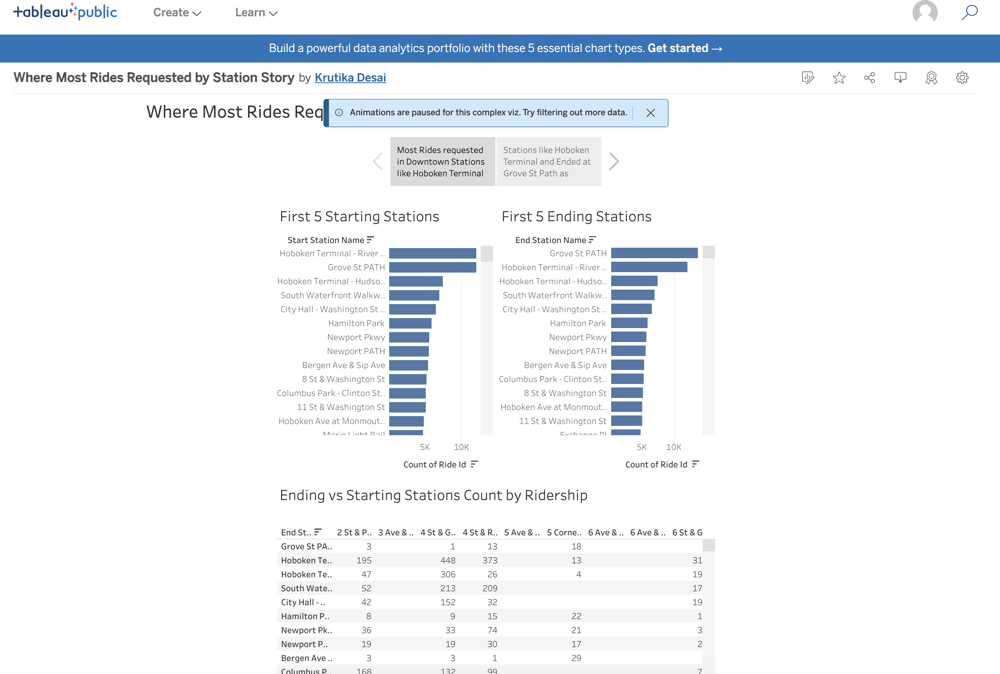 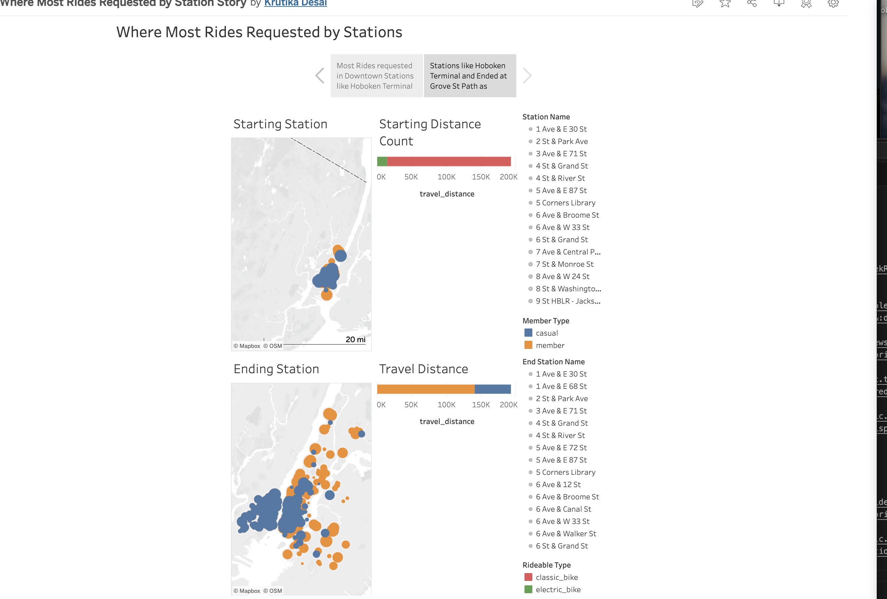 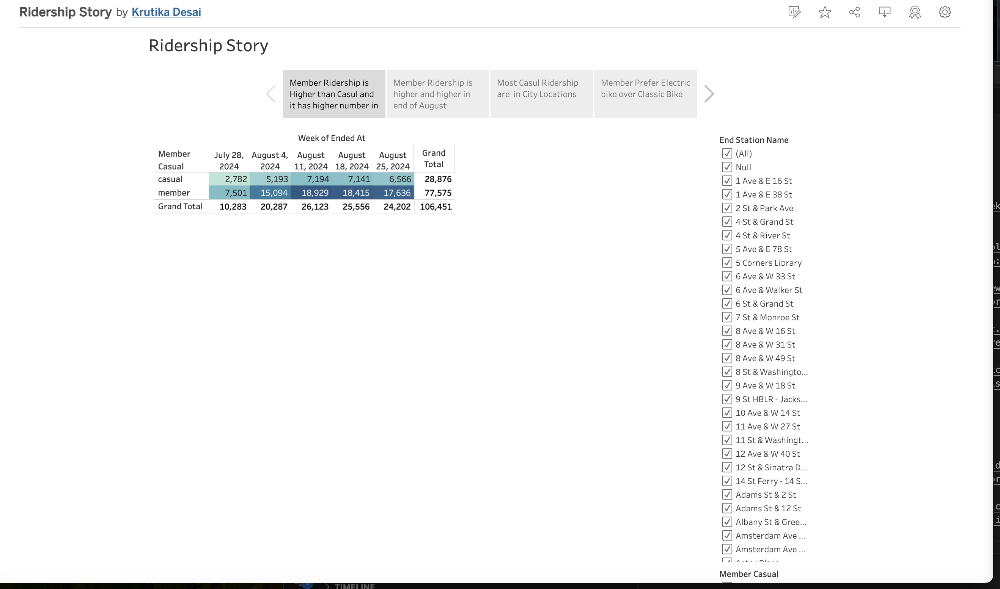 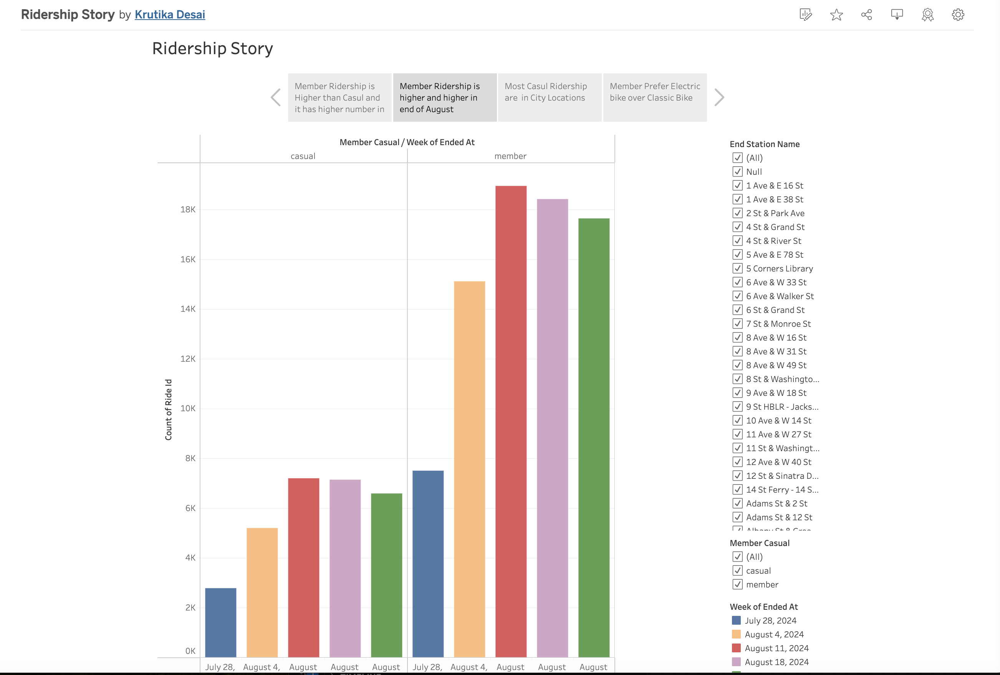 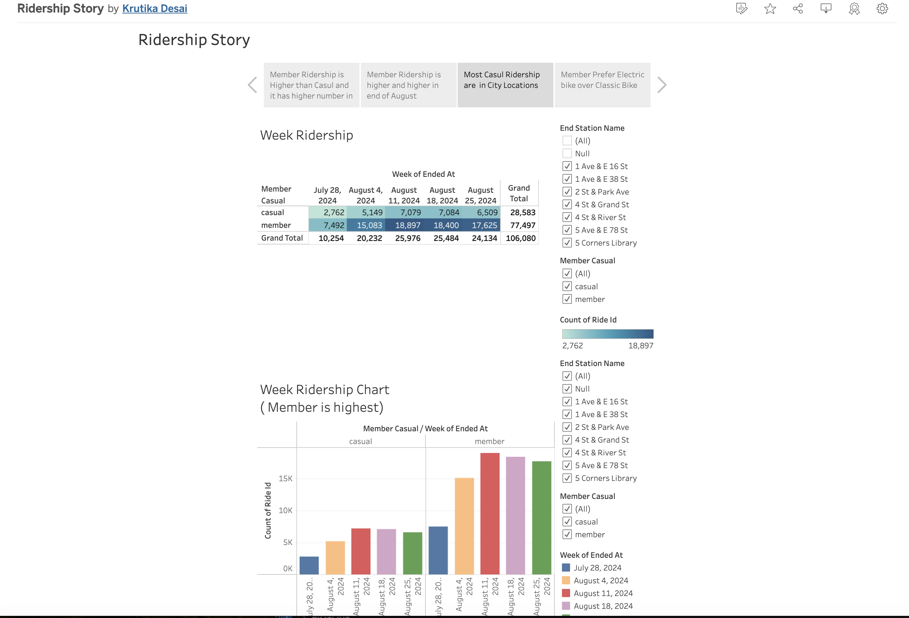 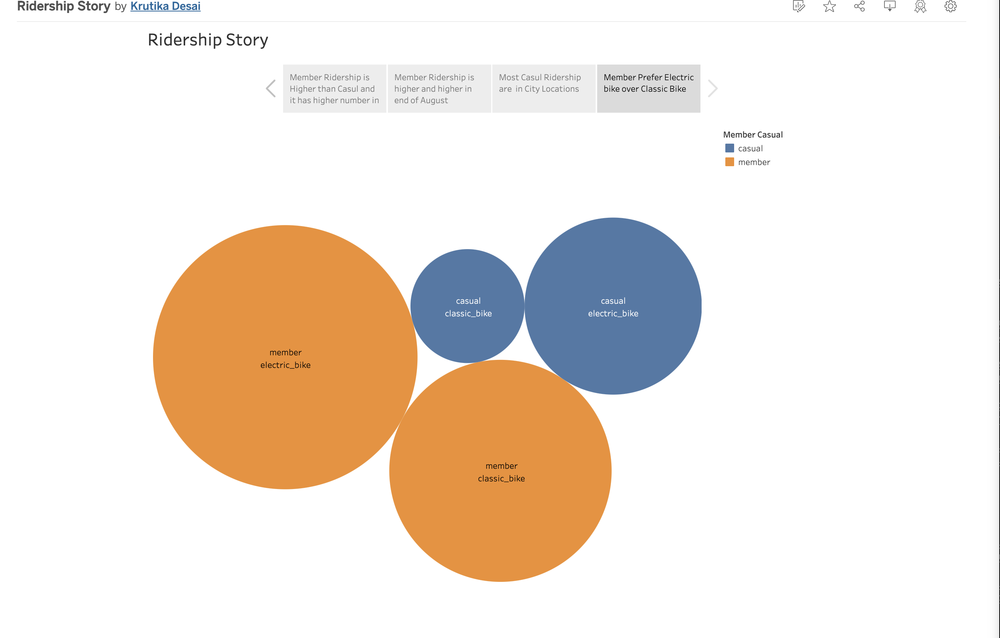 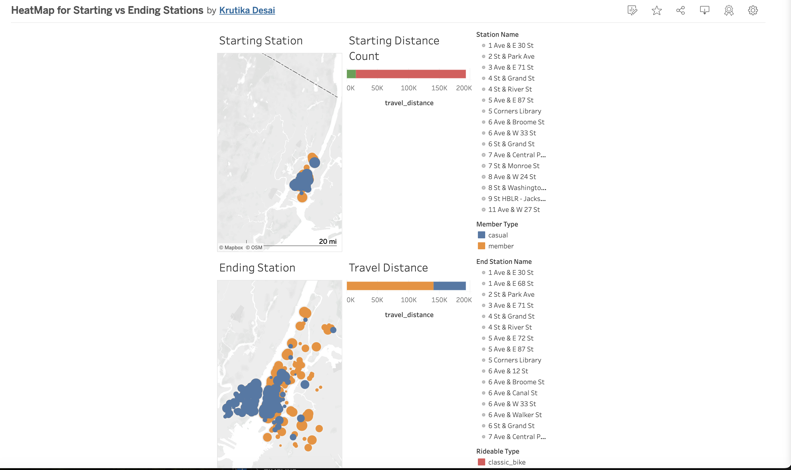 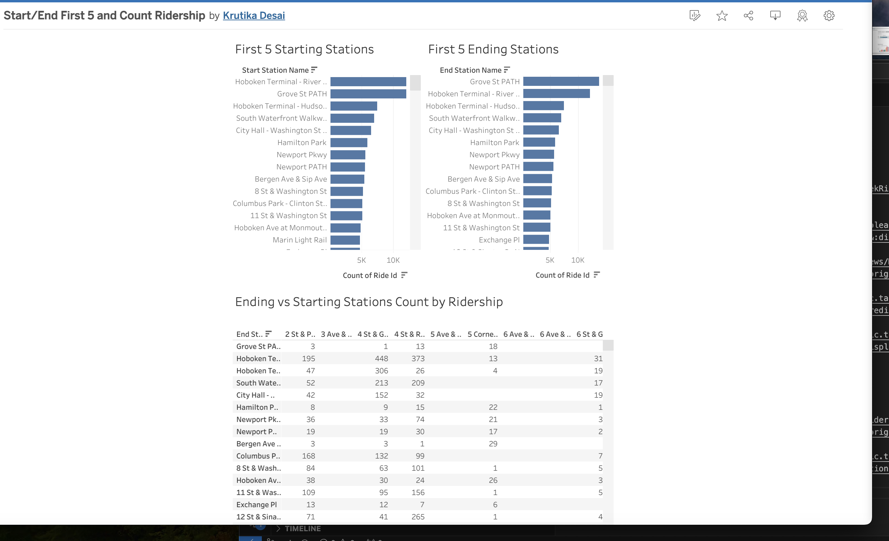 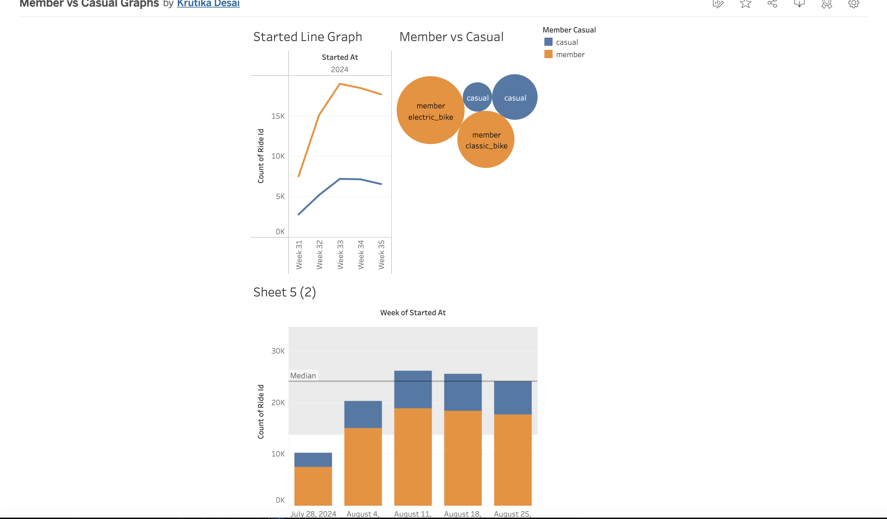 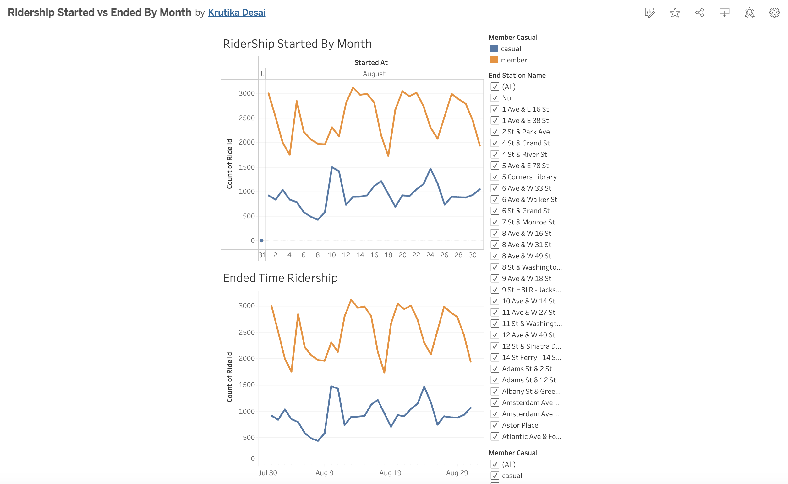 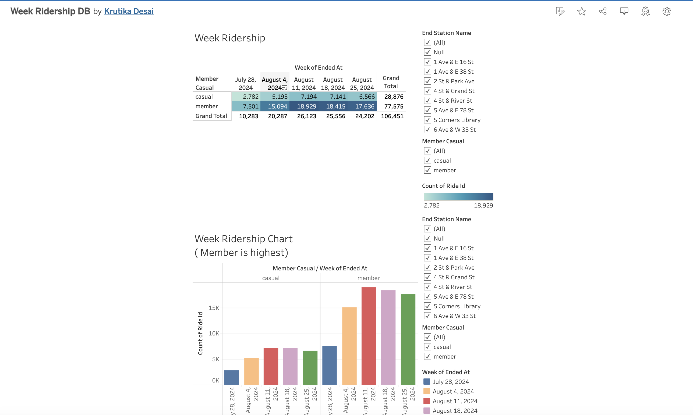